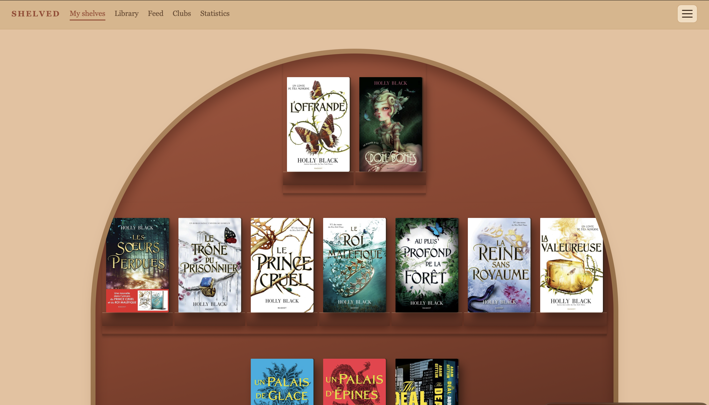
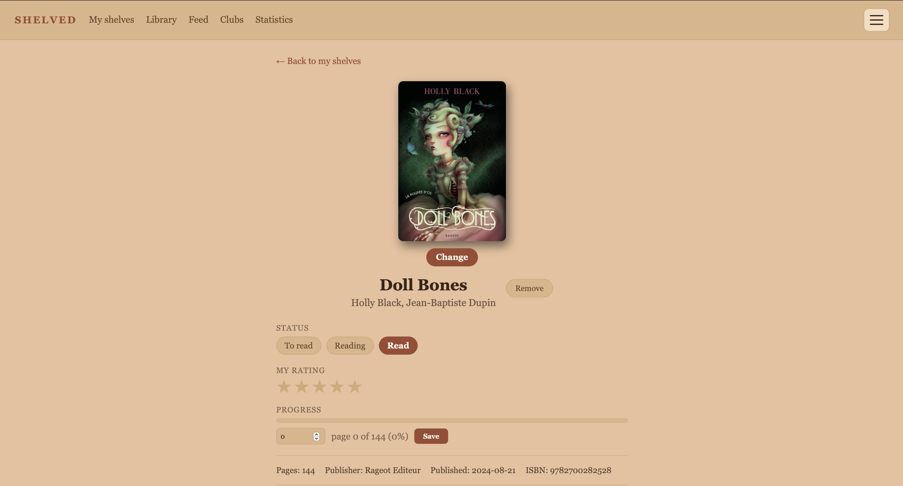
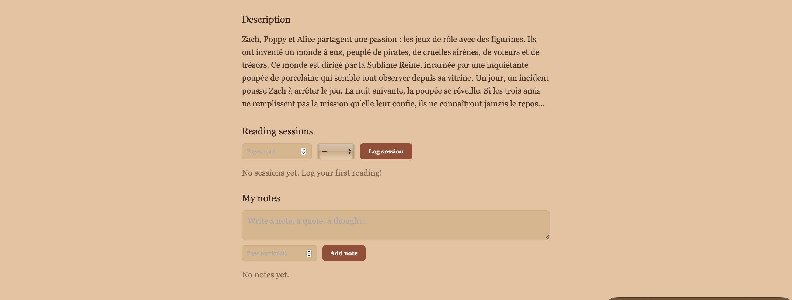
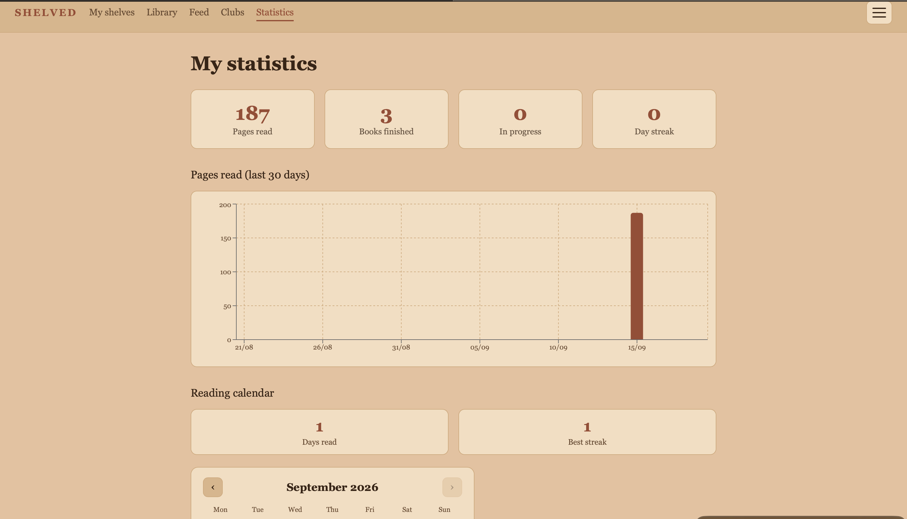

# SHELVED

*Version française — [English version here](README.md)*


Application web full-stack de suivi de lecture : on range ses livres sur une
étagère visuelle personnalisable, on suit sa progression, on échange avec
d'autres lecteurs et on reçoit des recommandations générées par IA.

Pensée dès le départ pour de **vrais utilisateurs** plutôt que comme exercice
isolé : authentification sécurisée, conformité RGPD, accessibilité,
7 langues (dont l'arabe en écriture droite-à-gauche), et une vraie stratégie
de maîtrise des coûts pour la partie IA.

---

## Aperçu visuel

**Page d'accueil — thème Niche Corail**


**Fiche d'un livre — statut, note, progression**


**Fiche d'un livre — description, sessions de lecture, notes**


**Statistiques de lecture**


---

## Fonctionnalités principales

**Bibliothèque et découverte**
Recherche de livres (Google Books) ou scan de code-barres à la caméra ;
étagère personnalisable (plusieurs thèmes visuels, glisser-déposer pour
réorganiser) ; suivi détaillé de la lecture (statut, note, progression,
sessions, notes personnelles).

**Social**
Profils publics, abonnements, fil d'activité généré automatiquement (j'aime,
commentaires), et clubs de lecture avec discussion et vote pour le prochain
livre.

**Intelligence artificielle**
Recommandations personnalisées avec score de compatibilité, mises en cache
pour ne pas ré-appeler l'API à chaque visite, et limite quotidienne par
utilisateur pour maîtriser les coûts.

**Compte et conformité**
Vérification d'email, mot de passe oublié, changement d'identifiants protégé
par mot de passe, suppression de compte conforme RGPD (toutes les données
associées sont effacées, y compris les fichiers stockés à l'extérieur), et
un système de modération pour les photos publiées par la communauté.

---

## Ce que ce projet démontre

- **Sécurité** — mots de passe hachés (bcrypt), sessions par JWT signé,
  jetons à usage unique et courte durée de vie pour les emails sensibles
  (vérification, reset), et des réponses volontairement identiques en cas
  d'échec de connexion pour ne jamais révéler quels comptes existent.
- **Accessibilité** — audit de contraste automatisé (WCAG) sur toute la
  palette de couleurs, navigation clavier complète (focus visible cohérent,
  Échap ferme les fenêtres modales, focus géré à l'ouverture), attributs
  ARIA sur les éléments interactifs, respect de `prefers-reduced-motion`.
- **Internationalisation réelle** — 7 langues dont l'arabe en écriture
  droite-à-gauche, aucun texte codé en dur dans les composants.
- **Intégration IA maîtrisée** — cache pour éviter les appels redondants,
  quota quotidien par utilisateur, et fournisseur d'IA isolé derrière un
  seul service pour pouvoir en changer sans toucher au reste du code.
- **Tests automatisés** — pytest côté API (base de données isolée, jamais
  les vraies données) et Vitest/React Testing Library côté interface, avec
  des tests de non-régression ciblant des bugs réellement rencontrés et
  corrigés en cours de développement.
- **Architecture propre** — couches séparées (routes / schémas de validation
  / modèles de données côté API), services externes isolés (stockage
  d'images, emails, IA) derrière une interface simple, logique de mise en
  page complexe extraite et testée indépendamment de l'interface.
- **Itération produit réelle** — plusieurs cycles de refonte visuelle et
  fonctionnelle basés sur des retours concrets, avec des choix parfois
  défaits une fois testés en situation réelle plutôt que gardés par
  principe.

---

## Stack technique

**Frontend** — React 19, Vite, React Router, i18next (traductions), Recharts
(graphiques), ZXing (scan de code-barres), variables CSS pour les thèmes,
Vitest + React Testing Library.

**Backend** — FastAPI, SQLAlchemy, SQLite (PostgreSQL prévu en production),
PyJWT + bcrypt, Pydantic, pytest.

**Services externes** — Google Books (recherche et couvertures), Cloudinary
(stockage des photos), Google Gemini (recommandations IA), Resend (emails
transactionnels) — tous sur des paliers gratuits, avec des clés isolées dans
des variables d'environnement.

---

## Architecture

```
Frontend (React + Vite)              ce que l'utilisateur voit
        │  HTTP / JSON
Backend (FastAPI + SQLAlchemy)       logique métier, validation, sécurité
        │
Stockage                             SQLite → PostgreSQL en production
        │                            Cloudinary (images)
Services externes                    Google Books · Google Gemini · Resend
```

---

## Démarrage rapide

Deux serveurs à lancer, chacun dans son terminal.

```bash
# Backend
cd backend
python3 -m venv venv
./venv/bin/pip install -r requirements.txt
cp .env.example .env   # puis renseigner les clés (voir les commentaires dans le fichier)
./venv/bin/uvicorn main:app --reload
# → http://localhost:8000 (doc interactive sur /docs)
```

```bash
# Frontend
cd frontend
npm install
npm run dev
# → http://localhost:5173
```

---

## Tests

```bash
cd backend && pytest        # tests API (base isolée, en mémoire)
cd frontend && npm test     # tests interface (Vitest + Testing Library)
```

---

## Auteure

Projet conçu, développé et itéré de bout en bout par **Oumayma Haddour**.

Distribué sous licence [MIT](LICENSE).
